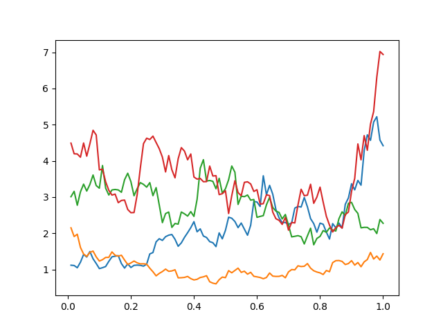

Advanced features of Pychastic
==============================

Multiple starting positions
'''''''''''''''''''''''''''

Sometimes we are interested in equilibrium properties of studied system. It is beneficial
to pick different initial conditions for each sample path in such way that starting
condition is distributed according to equilibrium configuration. Such behaviour 
is accomplished setting `x0` value in SDEProblem to a list of initial conditions 
and setting `n_trajectories` to `None` (setting `n_trajectories to a different value
raises an `ValueError`)

.. prompt:: python >>> auto

    import jax
    import matplotlib.pyplot as plt
    from pychastic.sde_solver import SDESolver
    from pychastic.sde_problem import SDEProblem

    solver = SDESolver(scheme="milstein", dt=1e-2)

    a = 1
    b = 1
    problem = SDEProblem(
        a=lambda x: a * x,
        b=lambda x: b * x,
        x0=1.0,
        tmax=1.0,
        exact_solution=lambda x0, t, w: x0 * np.exp((a - 0.5 * b * b) * t + b * w),
    )

    problem.x0 = jax.numpy.array([[1.],[2.],[3.],[4.]])

    result = solver.solve_many(problem, n_trajectories=None)

    for (t,x) in zip(result['time_values'],result['solution_values']):
        plt.plot(t,x)
        
    plt.show()
    
    

Memory management - sample discarding
'''''''''''''''''''''''''''''''''''''

In many cases (for example stiff equations) even though small step is required
we are not really interested in values at all steps. We can use this to our
advantage by discarding evaluation points which are not needed. You can accompish
this behaviour using `chunk_size` option of `solve` and `solve_many` methods.

Memory management - randomization discarding
''''''''''''''''''''''''''''''''''''''''''''

It is much more efficient to compute all random values in advance and not generate
noise at each step. Sadly this comes at memory cost. By default all randomization
is done before integrating trajectories, we can split this process into smaller
runs by using `chunks_per_randomization` option of `solve` and `solve_many` methods.

Step post-processing aka domain hacks
'''''''''''''''''''''''''''''''''''''

Whenever we are anaysing SDE or ODE on a manifold whose universal cover is not 
:math:`\mathbb{R}^n` we need to handle switching between charts. Similarily, if
we know that some constraint is satisfied exactly in our system (conservation of 
energy or momentum for example) we overcome error accumulation in conserved 
variables by projecting onto desired subspace after each step. Both of those needs
can be acomplished using `step_post_processing` option of `solve` and `solve_many`
methods. It takses a function which maps location in phase space onto adjusted new
location in phase space after each step.

.. prompt:: python >>> auto
    
    # Following code simulates rigid body rotations (dynamics on SO(3)) for more details
    # check our paper https://arxiv.org/abs/2209.04332
    import pychastic
    import jax.numpy as jnp
    import jax
    import matplotlib.pyplot as plt
    import numpy as np

    mobility = 2.0*jnp.eye(3)
    mobility_d = jnp.linalg.cholesky(mobility) # Compare with equation: Evensen2008.6

    def spin_matrix(q):
        # Antisymmetric matrix dual to q
        return jnp.array([[0, -q[2], q[1]], [q[2], 0, -q[0]], [-q[1], q[0], 0]])

    def rotation_matrix(q):
        # Compare with equation: Evensen2008.11
        phi = jnp.sqrt(jnp.sum(q ** 2))
        rot = (
            (jnp.sin(phi) / phi) * spin_matrix(q)
            + jnp.cos(phi) * jnp.eye(3)
            + ((1.0 - jnp.cos(phi)) / phi ** 2) * q.reshape(1, 3) * q.reshape(3, 1)
        )
        return jax.lax.cond(phi > 0.01, lambda: rot, lambda: 1.0 * jnp.eye(3))

    def transformation_matrix(q):
        # Compare with equation: Evensen2008.12
        phi = jnp.sqrt(jnp.sum(q ** 2))
        trans = (
            0.5
            * (1.0 / phi ** 2 - (jnp.sin(phi) / (2.0 * phi * (1.0 - jnp.cos(phi)))))
            * q.reshape(1, 3)
            * q.reshape(3, 1)
            + spin_matrix(q)
            + (phi * jnp.sin(phi) / (1.0 - jnp.cos(phi))) * jnp.eye(3)
        )
        return jax.lax.cond(phi > 0.01, lambda: trans, lambda: 1.0 * jnp.eye(3))

    def metric_force(q):
        # Compare with equation: Evensen2008.10
        phi = jnp.sqrt(jnp.sum(q ** 2))
        scale = jax.lax.cond(
            phi < 0.01,
            lambda t: -t / 6.0,
            lambda t: jnp.sin(t) / (1.0 - jnp.cos(t)) - 2.0 / t,
            phi,
        )
        return jax.lax.cond(
            phi > 0.0, lambda: (q / phi) * scale, lambda: jnp.array([0.0, 0.0, 0.0])
        )

    def t_mobility(q):
        # Mobility matrix transformed to coordinates.
        # Compare with equation: Evensen2008.2
        return transformation_matrix(q) @ mobility @ (transformation_matrix(q).T)

    def drift(q):
        # Drift term.
        # Compare with equation: Evensen2008.5 
        # jax.jacobian has differentiation index last (like mu_ij d_k) 
        # so divergence is contraction of first and last axis.
        return t_mobility(q) @ metric_force(q) + jnp.einsum(
            "iji->j", jax.jacobian(t_mobility)(q)
        )

    def noise(q):
        # Noise term.
        # Compare with equation: Evensen2008.5
        return jnp.sqrt(2) * transformation_matrix(q) @ (rotation_matrix(q).T) @ mobility_d

    def canonicalize_coordinates(q):
        phi = jnp.sqrt(jnp.sum(q ** 2))
        max_phi = jnp.pi
        canonical_phi = jnp.fmod(phi + max_phi, 2.0 * max_phi) - max_phi
        return jax.lax.cond(
            phi > max_phi,
            lambda canonical_phi, phi, q: (canonical_phi / phi) * q,
            lambda canonical_phi, phi, q: q,
            canonical_phi,
            phi,
            q,
        )

    problem = pychastic.sde_problem.SDEProblem(
        drift, noise, tmax=20.0, x0=jnp.array([1.0, 0.0, 0.0])
    )

    solver = pychastic.sde_solver.SDESolver(dt=0.01)

    trajectories = solver.solve_many(
        problem,
        step_post_processing=canonicalize_coordinates,
        n_trajectories=1000,
        chunk_size=100,
        chunks_per_randomization=1,
    )

    final_angles = np.array(
        jnp.sqrt(jnp.sum(trajectories["solution_values"][:, -1, :] ** 2, axis=1))
    )

