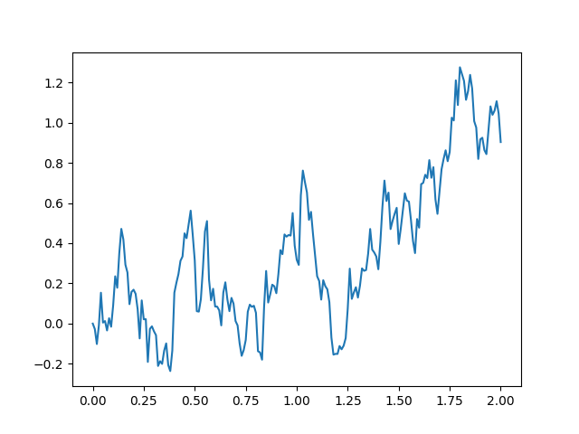
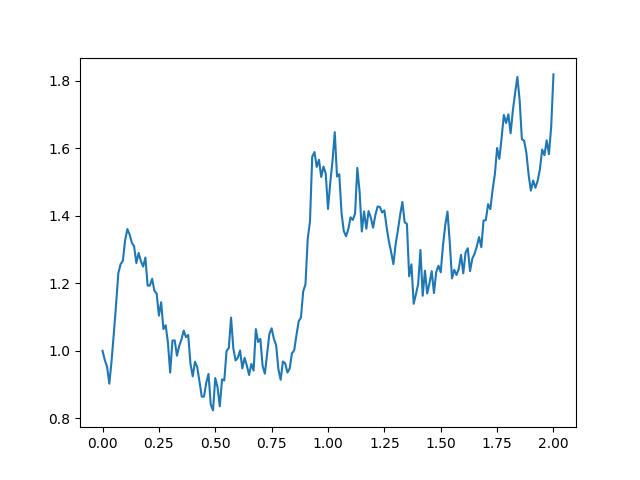

Examples
=======================================================

This page highlights some possible use cases of Pychastic package.

Simple Brownian motion
''''''''''''''''''''''

Brownain motion of a particle in one dimension is where SDE's started.
In this example there is no drift and noise is constant

.. prompt:: python >>> auto

  >>> import pychastic
  >>> problem = pychastic.sde_problem.SDEProblem(lambda x: 1.0,lambda x: 1.0,0.0,2.0)
  >>> solver = pychastic.sde_solver.SDESolver()
  >>> trajectory = solver.solve(problem)
  >>> trajectory
  {'time_values': array([0.,0.01,...]), 'solution_values' : array([0.,0.0082,...]),'wiener_values' : array([0.,0.0082,...])} #some values random
  >>> import matplotlib.pyplot as plt
  >>> plt.plot(trajectory['time_values'],trajectory['solution_values'])
  >>> plt.show()

Geometric Brownian motion
'''''''''''''''''''''''''

In this classic example both drift and noise are proportional to current value. Such process is used as model for stock market behaviour.

.. prompt:: python >>> auto

  >>> import pychastic
  >>> problem = pychastic.sde_problem.SDEProblem(lambda x: 0.2*x,lambda x: 0.5*x,1.0,2.0)
  >>> solver = pychastic.sde_solver.SDESolver()
  >>> trajectory = solver.solve(problem)
  >>> import matplotlib.pyplot as plt
  >>> plt.plot(trajectory['time_values'],trajectory['solution_values'])
  >>> plt.show()

