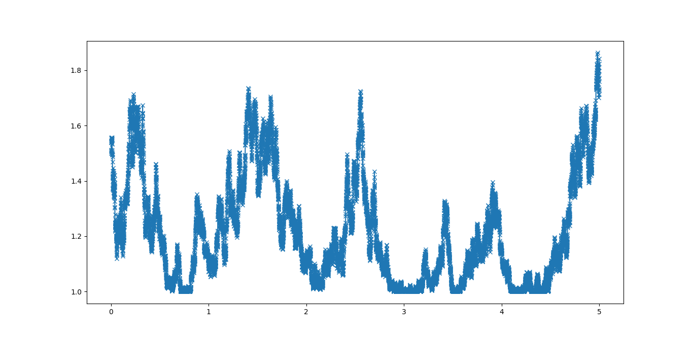
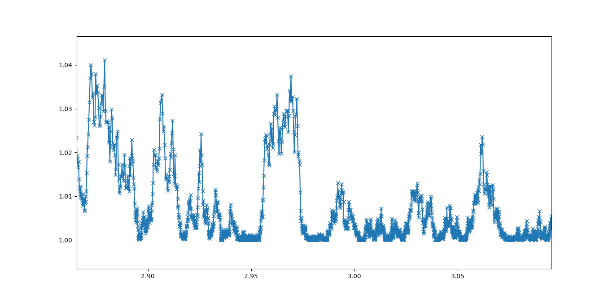

Pychastic for molecular simulations
===================================

Introduction - why bother?
''''''''''''''''''''''''''

Molecular dynamics finds applications in physics, material science, structural
biology and others. Main problem with making MD simulations is that ODEs
governing the systems are very stiff due to timescale disparity. One of shortest
timescales is viscosity mediated relaxation of solvents. There are generally two
ways of dealing with it -- explicit solvent and bigger supercomputer or implicit
solvent and often lack of hydrodynamic interactions. In either case estimating
diffusive properties of molecules is near impossible.

Here SDEs come to rescue -- correct formulation of overdamped dynamics reduces
order of ODEs to first order with stochastic noise removing shortest timescale
from the simulations. Additionaly in Stokesian regime hydrodynamic interactions
can be introduced via mobility matricies.

Mathematical setting
''''''''''''''''''''

In the following sections we'll be solving SDE of one or two variables. They're
most commonly written in differential form. Ito calculus is a little different
than typical real valued calculus in that functions we're working with (such as
Wiener processes realisations) are almost surely nowhere differentiable, this is
reflected in the notation by refusal to write expressions like :math:`dW/dt`.

Typical problem setting would look like:

.. math::

  dX = a dt + b dW

Here :math:`dX` represents change in value we're tracking, :math:`a dt` is 
systematic drift of our process and :math:`b dW` is noise term.

Sphere's brownian motion near a wall
''''''''''''''''''''''''''''''''''''

Simplest nontrivial example of brownian dynamics is suspension of noninteracitng
spheres in diffusion-sedimentation balance. It is exactly the setting under 
investigation in the famous 1905 paper by A. Einstein.

If we measure distance in multiples of particles radius and time in mutiples of 
:math:`R^2 / 2 k_b T \mu_\infty` and energies in multiples of :math:`k_b T` the 
equation becomes:

.. math ::
  dh = \frac{\partial_h \mu(h)}{2} dt 
  + \frac{\mu(h)}{\mu_\infty}\partial_h U(h) dt
  + \sqrt{2\frac{\mu(h)}{\mu_\infty}} dW

where :math:`\mu(h)` is the height dependent mobility function and :math:`U(h)` 
is height dependent potential energy.

In the simplest approximation we can take:

.. math ::
  U(h) = g h

  \mu(h) / \mu_\infty = 1 - 1/h

This way mobility goes to zero at contact with the wall and approaches bulk 
value far from the wall.

High performance code thanks to `jax.jit`
'''''''''''''''''''''''''''''''''''''''''

#### TODO ##### write someting about jax and jit, explain jnp

Simulating scalar SDEs
''''''''''''''''''''''

(If you want to enjoy plots as well you'll need ``matplotlib`` package)

.. prompt:: python >>> auto

  >>> import pychastic
  >>> import jax.numpy as np #to make jit acceleration possible
  >>> g = 2.0 # units are [k_b T / sphere size]
  >>> problem = pychastic.sde_problem.SDEProblem(
      lambda x: (1.0 / x**2) - (1.0-1.0/x)*g,
      lambda x: np.sqrt(2.0*(1.0-1.0/x)),
      1.5,
      50.0
      )
  >>> solver = pychastic.sde_solver.SDESolver()
  >>> trajectory = solver.solve(problem)
  >>> trajectory
  {'time_values': array([0.000e+00, 1.000e-02, ..., 5.001e+01]), 
  'solution_values': array([1.5, 1.49303699, ..., nan]), 
  'wiener_values': array([ 0., 0.01052365, ...])} #some values are random
  >>> import matplotlib.pyplot as plt
  >>> plt.plot(trajectory['time_values'],trajectory['solution_values'])
  >>> plt.show()

The ``SDEProblem`` constructor takes two callables (functions) as arguments. 
First one decribes the drift term, second one describes the noise term. In 
python you can define functions either by using ``def`` keyword or on-the-fly 
using ``lambda`` keyword like we did here.

We're using a slightly different flavor of numpy that being ``jax.numpy`` this
variant is compatible with *just-in-time compilation* which greatly increases
code speed (often to the same order of magnitude as C code).

Finally as you can see solution values starts with sensible numbers but from 
some point  it's filled with ``nan`` values. This is because of taking square 
root of negative value -- we've intersected the wall! This is an issue with time 
step being too large you can fix this by setting smaller timestep and better 
integration method either in ``SDESolver`` constructor or in ``solver.dt`` 
later (but before calling solve!)

.. prompt:: python >>> auto

  >>> import pychastic
  >>> import jax.numpy as np
  >>> g = 2.0
  >>> problem = pychastic.sde_problem.SDEProblem(
      lambda x: (1.0 / x**2) - (1.0-1.0/x)*g,
      lambda x: np.sqrt(2.0*(1.0-1.0/x)),
      1.5,
      5.0
      )
  >>> solver = pychastic.sde_solver.SDESolver(dt = 0.001, scheme = 'adaptive_milstein') # <-- selecting smaller step and better solver
  >>> trajectory = solver.solve(problem)
  >>> import matplotlib.pyplot as plt
  >>> plt.plot(trajectory['time_values'],trajectory['solution_values'])
  >>> plt.show()

When you zoom in on regions where sphere gets close to the wall you can see that
timestep decreases drastically, we're able to compute this trajectory in
acceptable time without giving solver explicit information about domain of the 
equation thanks to adaptive timestepping -- nice!

Generating many trajectories
''''''''''''''''''''''''''''

##### TODO ###### Generating ensembles fast

It's not uncommon that we're interested in a whole *ensemble* of trajectories.
Because of jit optimization it's much faster to generate trajectories together
rather than one at a time (considerable time is spent pre-compiling coefficient
functions, but this ideally happens only once).

.. prompt:: python >>> auto

  >>> import pychastic
  >>> import jax.numpy as np
  >>> g = 2.0
  >>> problem = pychastic.sde_problem.SDEProblem(
      lambda x: (1.0 / x**2) - (1.0-1.0/x)*g,
      lambda x: np.sqrt(2.0*(1.0-1.0/x)),
      1.5,
      5.0
      )
  >>> solver = pychastic.sde_solver.SDESolver(dt = 0.001, scheme = 'adaptive_milstein')
  >>> trajectories = solver.solve_many(problem,500)
  >>> import matplotlib.pyplot as plt
  >>> plt.histogram(trajectories['solution_values'][:,-1])
  >>> plt.show()

More degrees of freedom
'''''''''''''''''''''''

All of the above is neat but it's been well understood for a couple of decades 
now. Most likely you'd want to simulate many particles or at least one particle
that can roate and move in all three dimensions.

Unless you're really lucky and the problem separates into separate equations for
each of the directions you'll need to integrate all degrees of freedom 
simulataneously. It can be acomplished using vector SDEs.

Simulating vector SDEs
''''''''''''''''''''''

This section relies on package `pygrpy` for hydrodynamic interactions.
You can get it via pip by

.. prompt:: bash $ auto

  $ python3 -m pip install pygrpy

We'll be relying on `pygrpy.jax_grpy_tensors.muTT` functionality to get mobility
matricies in Rotne-Prager-Yakamava approximation.

Mobility matricies connect forces and velocities on particles via relation:

.. math::
    v_ai = \mu_{abij} F_{bj}

Where indicies :math:`a,b` go through spheres id and indicies :math:`i,j` 
through spatial dimensions.

Given the :math:`\mu` tensor we can express dynamics of all spheres as

.. math::
    dX_{ai} = \mu_{abij} \partial_{bj} U(X) dt + \sqrt{2 k_b T \mu_{abij}} dW_{ai} + k_bT \partial_{bj} \mu_{abij} dt

##### TODO ###### Chceck if Yakamawa approximation is divergence free.

Where :math:`U` denotes potential energy dependent on locations of all beads. It
turns out that Rotne-Prager-Yakamawa is particularly convenient for us as the 
last term including diverngence vanishes.

##### TODO ###### 2 spheres with hydrodynamic interaction

For now we'll simulate two beads connected by a spring of rest length `4.0`. 
We'll work in natural units where energy is measured in multiples of :math:`k_bT`
and distances in multiples of sphere's radii.

We cen go ahead and code this equation in python.

.. prompt::
    :language: python
    :prompts: >>>,...
    :modifiers: auto

    >>> import pychastic                   # solving sde
    >>> import pygrpy.jax_grpy_tensors     # hydrodynamic interactions
    >>> import jax.numpy as jnp            # jax array operations
    >>> import jax                         # taking gradients
    >>> import matplotlib.pyplot as plt    # plotting

    >>> radii = jnp.array([1.0,1.0]) # sizes of spheres we're using
    ... def u_ene(x): # potential energy shape
    ...      locations = jnp.reshape(x,(2,3))
    ...      distance = jnp.sqrt(jnp.sum((locations[0] - locations[1])**2))
    ...      return (distance-4.0)**2
    >>> def drift(x):
    ...      locations = jnp.reshape(x,(2,3))
    ...      mu = pygrpy.jax_grpy_tensors.muTT(locations,radii)
    ...      force = -jax.grad(u_ene)(x)
    ...      return jnp.matmul(mu,force)
    >>> def noise(x):
    ...      locations = jnp.reshape(x,(2,3))
    ...      mu = pygrpy.jax_grpy_tensors.muTT(locations,radii)
    ...      return jnp.sqrt(2)*jnp.linalg.cholesky(mu)

    >>> problem = pychastic.sde_problem.VectorSDEProblem(
    ...       drift,
    ...       noise,
    ...       x0 = jnp.reshape(jnp.array([[0.,0.,0.],[0.,0.,4.]]),(6,)),
    ...       dimension = 6,
    ...       noiseterms = 6,
    ...       tmax = 500.0)

    >>> solver = pychastic.sde_solver.VectorSDESolver()
    >>> trajectory = solver.solve(problem)

    >>> plt.plot(trajectory['time_values'],trajectory['solution_values'][:,0])
    >>> plt.plot(trajectory['time_values'],trajectory['solution_values'][:,3])
    >>> plt.show()
