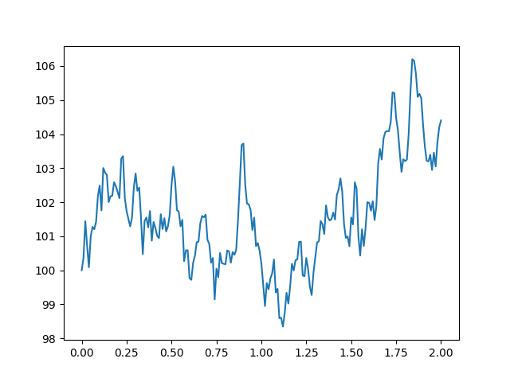
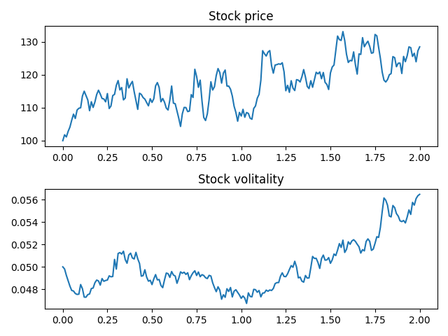

Pychastic for derivatives pricing
=================================

Introduction - why bother?
''''''''''''''''''''''''''

The Black-Sholes formula has a closed form expression,
so we're done for pricing european options. Well not really.
If you're here you probably have heared of stochastic volitality models,
or want to price more exotic instruments, these do not have closed form
expressions for expected return. This reflects more general observation.

*Stochastic differential equations are hard*

Much harder than ordinary differential equations at the very least, and even
those do not always have closed form solutions. So if you feel that going
monte-carlo on everything is not very elegant, in some cases it's nearly the 
only way forward.

Mathematical setting
''''''''''''''''''''

In the following sections we'll be solving SDE of one or two variables. They're
most commonly written in differential form. Ito calculus is a little different
than typical real valued calculus in that functions we're working with (such as
Wiener processes realisations) are almost surely nowhere differentiable, this is
reflected in the notation by refusal to write expressions like :math:`dW/dt`.

Typical problem setting would look like:

.. math::

  dX = a dt + b dW

Here :math:`dX` represents change in value we're tracking, :math:`a dt` is 
systematic drift of our process and :math:`b dW` is noise term.

Geometric brownian motion - simplest market model
'''''''''''''''''''''''''''''''''''''''''''''''''

Perhaps the simplest non-trivial SDE is that of geometric brownian motion. 
Investors generally prefer thinking in terms of proporions and returns rather 
than absolute values. This leads to assumption that the 'shakes' in price of, 
for example, stock should (generally speaking) be proportional to the price of 
such stock.

Mathematically we can express this as:

.. math::
  dX = \sigma X dW

Where :math:`\sigma` is proportionality constant (such as :math:`\sigma = 0.05`
to express 5% variations per one unit of time such as year).

This equation has exact solution :math:`X = X_0 \exp(-\sigma^2/2 t + \sigma W(t))`,
but we'll simulate it using ``pychastic`` package instead.

Simulating scalar SDEs
''''''''''''''''''''''

(If you want to enjoy plots as well you'll need ``matplotlib`` package)

.. prompt:: python >>> auto

  >>> import pychastic
  >>> problem = pychastic.sde_problem.SDEProblem(lambda x: 0.0,lambda x: 0.05 * x,100.0,2.0)
  >>> solver = pychastic.sde_solver.SDESolver()
  >>> trajectory = solver.solve(problem)
  >>> trajectory
  {'time_values': array([0.,0.01,...]), 'solution_values' : array([0.,0.0082,...]),'wiener_values' : array([0.,0.0082,...])} #some values random
  >>> import matplotlib.pyplot as plt
  >>> plt.plot(trajectory['time_values'],trajectory['solution_values'])
  >>> plt.show()

Here we define problem of stock with initial value of ``100.0`` (say dolars) and 
variability of ``5%`` per unit of time (say year) and we simulate it for ``2.0``
units of time (say years), with default time step of ``0.01`` (say years).

The ``SDEProblem`` constructor takes two callables (functions) as arguments. 
First one decribes the drift term, second one describes the noise term. In 
python you can define functions either by using ``def`` keyword or on-the-fly 
using ``lambda`` keyword like we did here.

Simulating vector SDEs
''''''''''''''''''''''

Perhaps you'd want a more complicated model of the market such as 
GARCH stochastic volitality. In this model stock volitality is described
by another stochastic differential equation:

.. math ::
  d v = \theta (\omega - v) dt - \xi v dW'

where :math:`\theta` controls volitatility mean reverting timescale, 
:math:`\omega` controls typical value of volitaility, :math:`\xi` controls 
variability of the volitaility and :math:`dW'` is another source of randomness.

Within this model we have to interconected random processes so we need a vector 
valued integrator to integrate them *simultaneously*.

We need to solve the following system of SDEs:

.. math ::
  d S = \mu dt + \sqrt{v} dW

  d v = \theta (\omega - v) dt - \xi v dW'

We'll put stock price in first component of our solution vector ``x[0]`` and 
volitaility value in the second component of our solution vector ``x[1]``.

.. prompt:: python >>> auto

  >>> import pychastic
  >>> import jax.numpy as jnp
  >>> theta = 0.1; omega = 0.05; xi = 0.1; mu = 0.01
  >>> problem = pychastic.sde_problem.SDEProblem(
        lambda x: jnp.array([mu, theta*(omega - x[1])]),
        lambda x: jnp.array([[jnp.sqrt(x[1])*x[0],0],[0,xi * x[1]]]),
        x0 = jnp.array([100.0,0.05]),
        tmax = 2.0
        )
  >>> solver = pychastic.sde_solver.SDESolver()
  >>> trajectory = solver.solve(problem)
  >>> import matplotlib.pyplot as plt
  >>> fig, axs = plt.subplots(2)
  >>> axs[0].plot(trajectory['time_values'],trajectory['solution_values'][:,0])
  >>> axs[1].plot(trajectory['time_values'],trajectory['solution_values'][:,1])
  >>> axs[0].set_title('Stock price')
  >>> axs[1].set_title('Stock volitality')
  >>> plt.tight_layout()
  >>> plt.show()

Note that ``VectorSDEProblem`` supports driving two equations with the same 
noise because of that we needed to pass a diagonal matrix as noise term 
description: each noise source is driving the respective equation.

Now suppose we want to price european call option with such model of the market.
We can simply simulate lots of trajectories and take expected payout at 
expiration time.

Because of ``jit`` magic it's much faster to generate all trajectories at once 
rather than one at a time. Method ``solve_many`` is just what we need here.

.. prompt:: python >>> auto

  >>> import pychastic
  >>> import jax.numpy as jnp
  >>> theta = 0.1; omega = 0.05; xi = 0.1; mu = 0.01
  >>> problem = pychastic.sde_problem.SDEProblem(
        lambda x: jnp.array([mu, theta*(omega - x[1])]),
        lambda x: jnp.array([[jnp.sqrt(x[1])*x[0],0],[0,xi * x[1]]]),
        x0 = [100.0,0.05],
        tmax = 2.0
        )
  >>> solver = pychastic.sde_solver.SDESolver()
  >>> n_traj = 100 # number of monte-carlo runs
  >>> trajectory = solver.solve_many(problem,n_traj)
  >>> final_values = trajectory['solution_values'][:,-1]
  >>> strike = 120.0
  >>> call_payouts = jnp.maximum(final_values - strike,jnp.zeros_like(final_values)) # max(S-K,0)
  >>> call_pricing = jnp.mean(call_payouts)
  >>> call_pricing
  3.76

If you change ``n_traj`` from ``100`` to ``1000`` you'll notice that computation
time increased only a litle bit, not 10 fold. This is because of ``jit`` 
compilation taking some time but happening only once at the beginning.

You're good to go! There are many options that control the integration precision
and speed. You can choose different algorithms for integration as well.

For comprehensive (600 page long) book on the topic try *Numerical Solution of
Stochastic Differential Equations* P. Kloden & E. Platen; Springer (1992)
